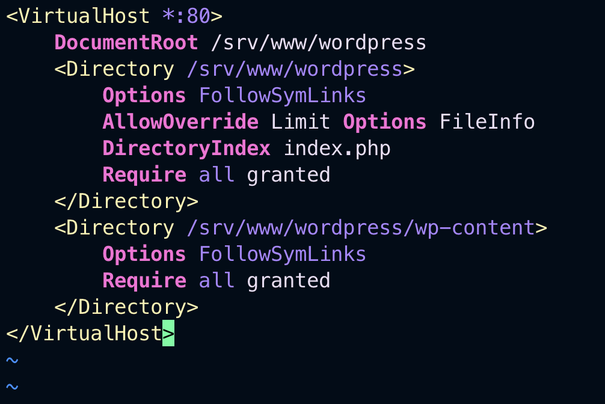

# Setting up a WordPress Website on a Virtual Machine with Vagrant and Ubuntu

Prerequisites

- Vagrant installed on your local machine
- Basic knowledge of the command line interface

## Step 1: Initialize and start Vagrant

Initialize and add a vagrant file folder of the project

`vagrant init ubuntu/bionic64`

start the virtual machine

`vagrant up`

## Step 2: Install WordPress dependencies

Run the following commands to update the package index and install the required packages:

`sudo apt update`

`sudo apt install apache2 ghostscript libapache2-mod-php mysql-server php php-bcmath php-curl php-imagick php-intl php-json php-mbstring php-mysql php-xml php-zip -y`

## Step 4: Download and extract WordPress

`curl https://wordpress.org/latest.tar.gz | sudo -u www-data tar zx -C /srv/www`

## Step 5: Configure Apache for WordPress

Create a new Apache virtual host configuration file for WordPress:

`vi /etc/apache2/sites-available/wordpress.conf`

## Step 6: Enable the WordPress site and Apache modules

Enable the WordPress site and the required Apache modules:

`sudo a2ensite wordpress`

`sudo a2enmod rewrite`

Disable the default Apache site:

`sudo a2dissite 000-default`

Finally, reload apache2 to apply all these changes:

`sudo service apache2 reload`

## Step 7: Configure WordPress

Configure database [Follow this Link](https://ubuntu.com/tutorials/install-and-configure-wordpress#5-configure-database){:target="\_blank"}
